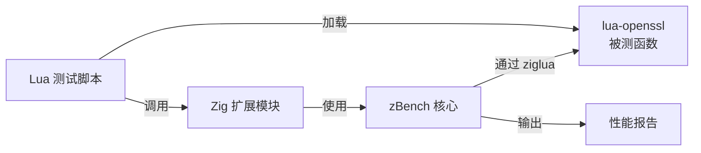

对基于 **`zBench`** 封装一个 **Lua 性能测试框架**的方案进行全面评估，我的结论是：这不仅是可行的，而且“复用专业微基准测试库”的思路，比从零用 Zig 实现计时器要合理得多。不过，这个方案的工程挑战并非常规的跨语言调用（`zBench` 在这方面的设计比较干净），而是如何解决两个运行时环境（Zig Native 与 Lua VM）在测试语义上的根本差异。

---

### 📊 一、zBench 核心能力评估

**`zBench`** 是一个专为 Zig 语言设计的微基准测试框架，它的核心能力恰好能填补 `lua-openssl` 性能评估的需求：

| 能力维度 | zBench 实现方式 | 价值评估 |
| :--- | :--- | :--- |
| **核心引擎** | 基于**时间预算**的自适应迭代 (`time_budget_ns`) | 直接对应密码函数测量痛点，无需手动校准 |
| **结果统计** | 提供均值、标准差、最小值、最大值、**p75/p99/p99.5** 百分位数 | 深度分析性能分布的必备能力 |
| **内存分析** | **分配跟踪** (`track_allocations`) 与**随机分配器** (`ShufflingAllocator`) | 分析 `lua-openssl` 在 GC 下的真实内存开销 |
| **执行控制** | **生命周期钩子**（`before_all`、`before_each` 等） | 能够管理 Lua 状态的初始化与清理 |
| **API 简洁性** | Zig 原生风格，通过 `Benchmark.add` + `run` 完成测试 | 封装后 Lua 侧 API 可大幅简化 |
| **基线噪音** | 空操作基线约 15ns，明确标识为系统开销 | 为可信的比较提供基线 |

---

### 🧩 二、可行性：构建 Hybrid 测试框架

核心思路是：**让 `zBench` 运行在 Zig 侧，通过 `ziglua` 驱动 Lua 代码执行**。

#### 1. 整体架构


#### 2. 关键实现：将 Lua 函数包装为 `BenchFunc`

`zBench` 要求的基准函数签名是 `fn(std.mem.Allocator) void`。我们需要将 Lua 函数调用包装进这个签名：

```zig
pub fn wrapLuaBenchmark(allocator: std.mem.Allocator) void {
    _ = allocator;

    // 获取保存的 lua_State 和函数引用
    const state = getStoredLuaState();
    const func_ref = getStoredFunctionRef();

    // 调用 Lua 函数（利用 ziglua 封装）
    lua_rawgeti(state, LUA_REGISTRYINDEX, func_ref);
    lua_pcall(state, 0, 0, 0);
}
```

将上述函数作为基准注册到 `zBench`，即可驱动 Lua 代码进行性能测试。

#### 3. 利用生命周期钩子管理 Lua VM

`zBench` 的 `Hooks` 结构体支持 `before_all`、`after_all`、`before_each`、`after_each` 四个阶段：

*   **`before_all`**：创建 Lua 状态、加载 `lua-openssl`、预热 JIT。
*   **`before_each`**：重置 Lua 栈、准备测试数据。
*   **`after_each`**：清理临时数据、触发 GC。
*   **`after_all`**：销毁 Lua 状态、释放资源。

这为测试的隔离性和可重复性提供了坚实基础。

#### 4. Lua 侧的极简 API

封装后，用户只需在 Lua 脚本中定义测试函数：

```lua
local bench = require("lua_bench")

-- 定义被测函数
local function test_rsa_verify()
    -- ... lua-openssl 代码 ...
end

-- 运行测试（自动完成预热、采样、统计）
local results = bench.run("RSA 签名验证", test_rsa_verify, {
    time_budget_ms = 2000,  -- 对应 zBench 的 time_budget_ns
    track_memory = true,    -- 启用内存分配跟踪
})
```

相比手动编写计时与统计逻辑，这种声明式 API 能极大降低性能测试的门槛。

---

### ✅ 三、合理性：为何值得采用

#### 1. 技术栈完全匹配
`ziglua` 已提供类型安全的 Lua C API 绑定，且 `zBench` 本身是用 Zig 编写的跨平台库。两者在语言和工具链上完全一致，集成时无需引入额外的中间层。

#### 2. 复用成熟的专业能力
`zBench` 的统计引擎（百分位数、标准差）和自适应迭代策略，都是经过验证的微基准测试最佳实践。将这套机制完整迁移到 Lua 生态，相当于为 Lua 引入了类似 **JMH（Java Microbenchmark Harness，Java 微基准测试框架）** 的专业基础设施。

#### 3. 避免重复造轮子的常见陷阱
从零实现一个微基准测试框架，很容易落入：
*   **统计不足**：只报告平均值，掩盖长尾延迟。
*   **热身缺失**：未进行 JIT 预热，测得“冷代码”性能。
*   **噪音未隔离**：未消除 OS 调度、时钟漂移等影响。

`zBench` 作为相对成熟的 Zig 社区库（210 stars、25 releases），已解决了这些基础问题。

---

### ⚠️ 四、不足之处：三大工程挑战

尽管方案整体可行且合理，有三个影响测试准确性的根本性挑战需要正视：

#### 1. 运行时环境隔离
*   **问题**：`zBench` 在 Zig Native 代码中执行基准循环，被测的 Lua 函数通过 C API 调用。Lua 的 C API 调用本身就是一次 **FFI 调用**，其开销（通常数十到数百纳秒）会叠加到每次测试迭代中。
*   **影响**：对于单次执行耗时就达微秒级的密码操作（如 RSA 签名），FFI 开销占比很小，可接受。但对于极快的操作（如 `EVP_CipherUpdate`），FFI 开销可能成为主要成分，导致测试结果偏离真实性能。

#### 2. Lua 上下文生命周期管理
*   **问题**：`zBench` 的多线程并发测试策略与 Lua 状态的单线程模型可能冲突。若 `zBench` 未来引入并行测试能力，需要额外处理 Lua 状态的线程安全性。
*   **影响**：目前 `zBench` 以串行方式运行基准，尚不会触发此问题。但若未来版本引入并行能力，则需为每个线程创建独立的 `lua_State`，增加复杂性。

#### 3. 内存开销的“抵消效应”
*   **问题**：`zBench` 的 `track_allocations` 功能使用自定义分配器记录每次内存分配。当此功能用于 Lua 扩展时，会捕获到测试框架自身的内存操作，与 Lua VM 内部的内存分配混在一起，难以区分。
*   **影响**：这可能导致内存分配数据失真。例如，`lua-openssl` 在内部 OpenSSL 调用中的分配，与框架的分配追踪器开销无法清晰分离。

---

### 💡 五、优化建议：并非纯粹的“直接封装”

要准确评估 `lua-openssl` 的真实性能，建议对 `zBench` 进行**场景化适配**：

1.  **批量调用**：在 `BenchFunc` 中循环调用 Lua 函数 **N** 次，然后除以 N 得到平均单次耗时。这是对极快操作最有效的降噪手段。
2.  **预热阶段**：在正式采样前，使用 `before_all` 钩子多次调用被测函数，确保 LuaJIT 完成跟踪记录与编译优化。
3.  **环境隔离**：为每个基准创建独立的 `lua_State`，避免不同测试间的状态干扰。
4.  **基线测量**：增加一个“空操作”基准，测量完整调用路径的固定开销，便于从最终结果中剔除。
5.  **可选的内存追踪**：将 `track_allocations` 设计为可关闭项，在关注内存分配时单独分析。

---

### 📈 六、与自建方案的对比

| 维度 | **基于 zBench 封装** | **自建计时器方案** |
| :--- | :--- | :--- |
| 统计能力 | 成熟（百分位数、标准差） | 需重新实现 |
| 内存分析 | 内置支持 | 需重新实现 |
| 自适应批处理 | 内置支持 | 需重新实现 |
| 跨语言开销 | 已知（FFI 调用） | 相同 |
| 开发成本 | 低（约 200 行胶水代码） | 高 |
| 维护成本 | 低（依赖社区维护） | 高 |
| 定制灵活性 | 中 | 高 |

---

### 💎 总结

基于 `zBench` 构建 Lua 性能测试框架，是当前场景下**综合成本最低、专业度最高**的选择。这套方案相当于将 Zig 生态的成熟微基准测试能力，以极低的成本迁移到了 Lua 生态。

真正的工程重点，不应是能否封装，而是 **如何设计 Lua 测试脚本来规避 FFI 开销、精确测量密码函数的真实性能**。`zBench` 已经是一个足够优秀的起点，它能为你扫清微基准测试中 80% 的通用障碍，而你只需专注于那 20% 的 Lua 生态专有问题。
